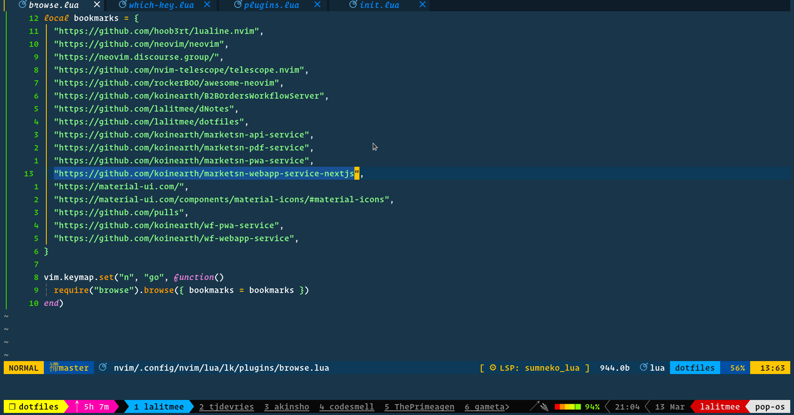

<div align="center">

# browse.nvim

##### browse for anything using your choice of method


[](http://www.lua.org)
[](https://github.com/lalitmee/browse.nvim/blob/main/LICENSE)



</div>

## Features

- cross platform
- reduces your search key strokes for any stackoverflow query

## Requirements

- [neovim](https://github.com/neovim/neovim) (nightly)
- [telescope.nvim](https://github.com/nvim-telescope/telescope.nvim) (if you
  want to browse bookmarks otherwise no need)
- [xdg-open](https://linux.die.net/man/1/xdg-open) (linux)
- [open](https://ss64.com/osx/open.html) (mac)
- [start](https://docs.microsoft.com/en-us/windows-server/administration/windows-commands/start) (windows)

## Installation

- [packer.nvim](https://github.com/wbthomason/packer.nvim)

  ```lua
  use({
    "lalitmee/browse.nvim",
    requires = { "nvim-telescope/telescope.nvim" },
  })
  ```

- [vim-plug](https://github.com/junegunn/vim-plug)

  ```vim
  Plug 'nvim-telescope/telescope.nvim'
  Plug 'lalitmee/browse.nvim'
  ```

## Usage

`browse.nvim` exposes the following:

- input search

```lua
require('browse').input_search()
```

- bookmarks search with the table `bookmarks`

```lua
require("browse").open_bookmarks({ bookmarks = bookmarks })
```

- browse which opens `telescope.nvim` dropdown theme to select the method

```lua
require("browse").browse({ bookmarks = bookmarks })
```

### bookmarks

For bookmarks you can declare your bookmarks in lua table format. for example:

```lua
local bookmarks = {
  "https://github.com/hoob3rt/lualine.nvim",
  "https://github.com/neovim/neovim",
  "https://neovim.discourse.group/",
  "https://github.com/nvim-telescope/telescope.nvim",
  "https://github.com/rockerBOO/awesome-neovim",
}
```

and then pass this table into the `browse()` function like this

```lua
vim.keymap.set("n", "<leader>b", function()
  require("browse").browse({ bookmarks = bookmarks })
end)
```

> If this `bookmarks` table will be empty or will not be passed and if you select `Bookmarks`
> from `telescope` result, you will not see anything in the telescope results.

## Roadmap

I have some plans in my mind:

1. Websites integrations

- devdocs
- raise an issue if you think we can do something more...

2. tags or file type specific queries

I know there are many things which can be done with this but for now I wanted
this simple functionality. If you are interested in enhancing this, Pull Requests
are welcome.

## Acknowledgements

- [telescope.nvim](https://github.com/nvim-telescope/telescope.nvim)
